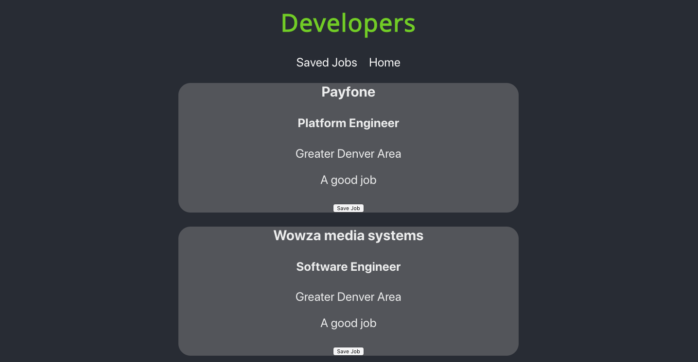
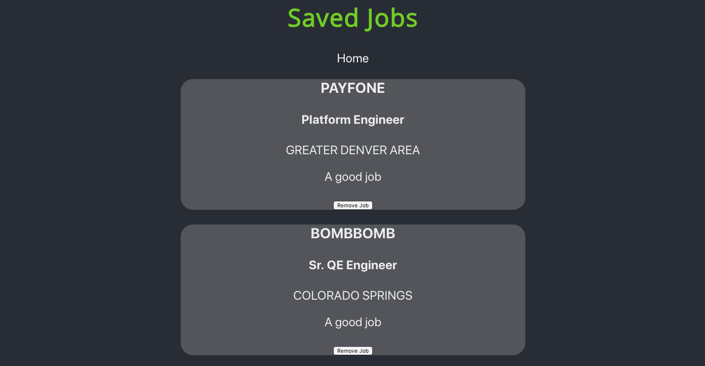
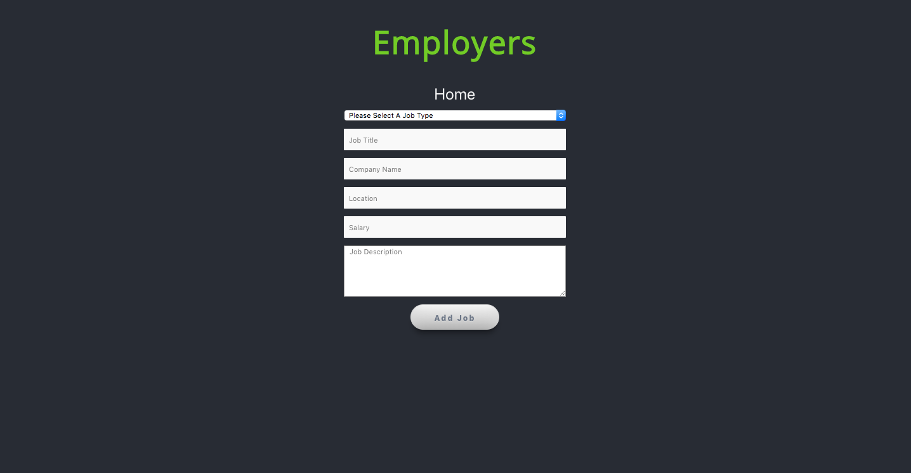

# DevConnect

#### By <a href="https://github.com/brandonfiebiger"> Brandon Fiebiger</a> and <a href="https://github.com/kmiller9393">Kurt Miller</a>

### Project

DevConnect is an intuitive application that utilizes scraped job information from BuiltInColorado's website. This application is for both job seekers (software engineers) and employers; job seekers can chose from a list of jobs to save to their "saved jobs" section and employers can post jobs for job seekers to view. This project was built using Node.js/Express.js, Knex and PostgreSQL on the backend as well as React, Redux, React Router and Sass for styling on the frontend.

We used Jest and Enzyme to build out our testing suite.

#### Getting Started

1. clone down this repository, cd into the dev-connect directory && `npm install`.

2. go to https://github.com/kmiller9393/byob and clone down that repository (this is the backend).

3. cd into the byob directory && `npm install' && run`nodemon server.js`.

4. within the dev-connect directory run `npm start`

### UI

#### Landing Page

#### Job Seekers Page

#### Saved Jobs Page

### Employers Page

